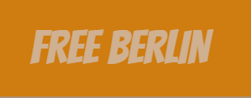
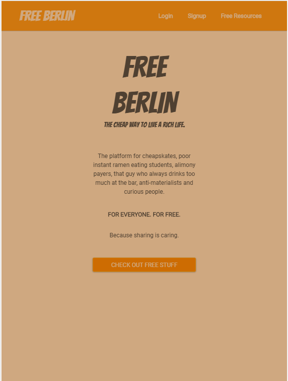
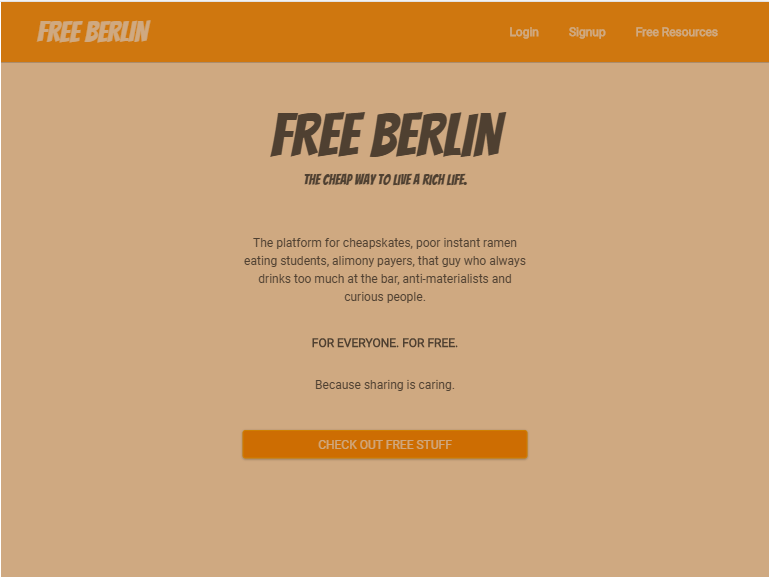
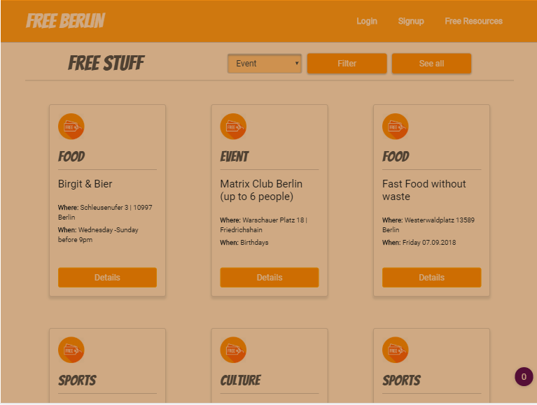
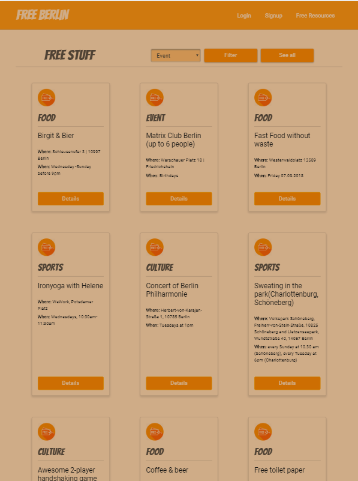
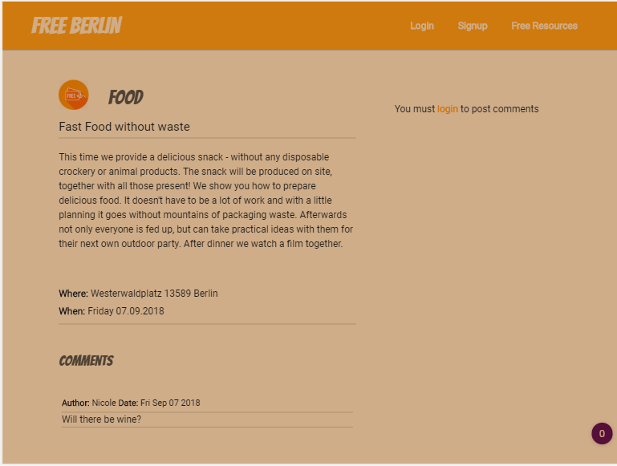
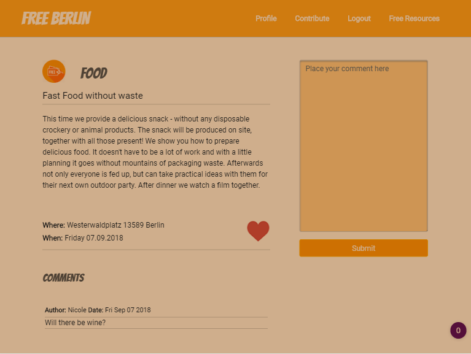
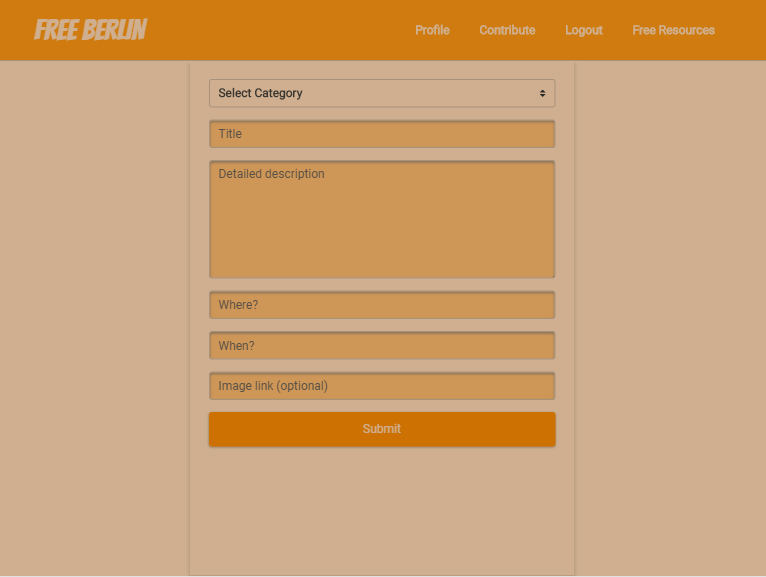
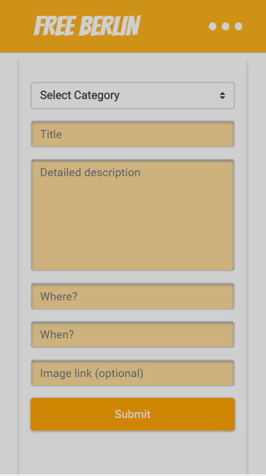
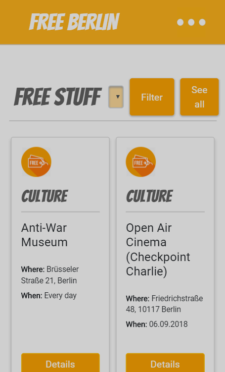

# FreeBerlin - The cheap way to live a rich life! 
## A web app to share, save and find free resources all over Berlin
This is our second project of our Web Development Bootcamp at Ironhack, focusing on the backend.

Created using HTML5, CSS, SASS, Bootstrap, Node.js, MongoDB, Mongoose, Express, Passport.js.



by Alina and Samuele

## Screenshots




















## How to run this on your local machine
### Prerequisites

You need to have NodeJS and MongDB installed on your computer.

###Commands

1. Clone or copy this project
```
$ git clone https://github.com/AlinaKr/Free-Berlin-Project-2-.git
```

2. In the directory of the project run this command:

```
$ npm install
```

3. If not already present, add a .env file in the root of the project folder:

```
PORT=5000
MONGODB_URI=mongodb://localhost/27017/freeberlin
```

4. To get the application up and running open a terminal window and run

```
$npm run dev // -> # Server running on http://localhost:5000/
```


Alternately direct your browser to the live version on [Heroku](https://free-berlin.herokuapp.com). 